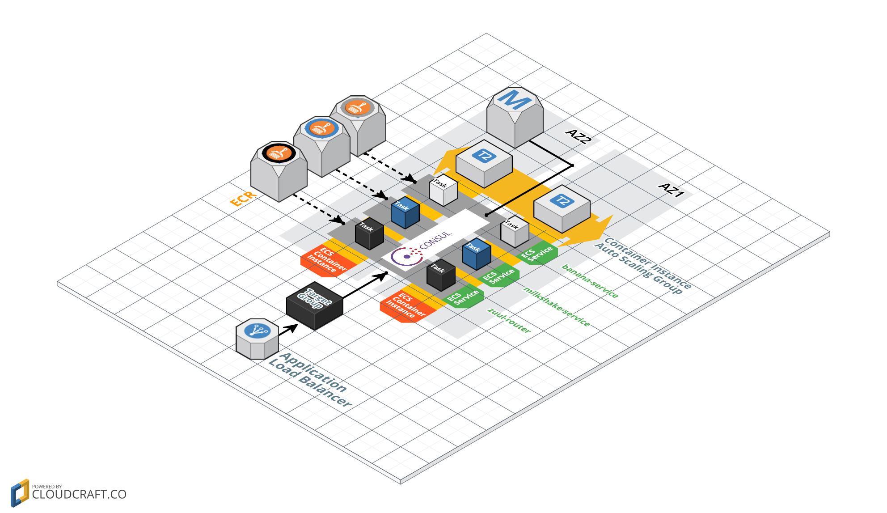

# Overview
This repository contains a lab for the [mu](https://github.com/stelligent/mu) workshop.  The goal of this lab is to add service discovery for microservice to microservice commnication based on the service from the [first lab](https://github.com/stelligent/mu-workshop-lab1).




# Continue from lab 2
This lab assumes that you have a pipeline successfully deployed in the first and second labs.  You can see a completed version of the second lab on the [solution](https://github.com/stelligent/mu-workshop-lab2/tree/solution) branch.

#  Pipeline
Now that our service is ready to test, let's update the pipeline for the service:

```
mu pipeline up
```

Finally, push the changes to trigger a pipeline invocation:

```
git add --all
git commit -m "mu testing"
git push
```


# Explore and wait...
While we wait for the pipeline to run, let's explore what mu created:

* **CloudFormation console** - Whats's new

* **Consul UI** -

* **Test the service** - Once the pipeline is successfully deployed to the **dev** environment, test it!
